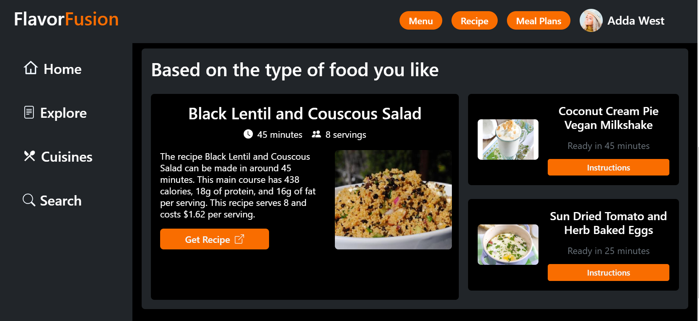

# **FlavorFusion**
FlavorFusion brings you a delightful culinary experience by providing a wide range of features for recipe search, meal recommendations, and wine pairing suggestions. With it's intuitive features and comprehensive database, the app aims to enhance your cooking experiences and elevate your enjoyment of food.

## Overview

### Features
- Personalized Recipe Recommendations based on the user's chosen diet plan.
- Search for recipes by ingredient, cuisine or meal-type.
- Meal Plans with corresponding recipes. Recipes available for breakfast, lunch, and dinner.
- Diverse selection of over 27 cuisines, including Italian and Indian cuisines with wine pairings for each recipe.

### Screenshot


### Links

- Solution URL: [GitHub](https://github.com/Owanate/flavor-fusion)
- Live Site URL: [Netlify](https://flavorfusion-app.netlify.app/)

## My Process
FlavorFusion is built using HTML, CSS, and JavaScript. It is a fully responsive web application that works on desktop and mobile devices.

### Built with

- Semantic HTML5 markup
- Bootstrap 
- Mobile-first workflow
- [jQuery](https://www.w3schools.com/jquery/jquery_syntax.asp)
- Vite

### What I learned
- String manipulation using regex and JavaScript string methods.
- Effective debugging using the Console in Chrome Dev Tools.
- How to use Bootstrap. breakpoints and components like modals and Offcanvas.
- Using the jQuery validation plugin to validate a form.
- Using Web APIs like Web Storage API and FormData API for user authentication.

### Useful Resources
- SweetAlert: [Official Docs](https://sweetalert2.github.io/)
- jQuery Validation: [Official Documentation](https://jqueryvalidation.org/)
- FormData API: [JavaScript Info](https://javascript.info/formdata)

## Setup
### Prerequisites
Before you begin, make sure you have the following installed on your machine:

- Node.js and npm
- Git

### Installation
1. Clone the repository
```bash
git clone https://github.com/Owanate/flavorfusion.git
```
2. Navigate to the project repository
```bash
cd flavorfusion
```
3. Install dependencies
```
npm install 
```

### Usage
#### Development Server
To run the development server, use the following command:
```
npm run dev
```
#### Build for Production
To build the project for production, use the following command:
```
npm run build
```
This will generate a dist folder containing the optimized and minified production-ready files.

## License
This project is licensed under the MIT License. Feel free to use, modify, and distribute the code as per the terms of the license.